<h1 align="center">Hi, I'm Hammed Akinwale 👋</h1>
<h3 align="center">Platform & Cloud Infrastructure Engineer — moving toward AI Infrastructure</h3>

Building reliable cloud platforms today. Exploring AI infrastructure for tomorrow.

---

### About Me

I'm a Platform and Cloud Infrastructure Engineer with **3+ years** designing, automating, and operating production-grade, multi-cloud infrastructure (**AWS, GCP, Azure**) for regulated fintech and blockchain platforms.

At **Convexity**, I own and operate infrastructure for **four regulated production platforms** — supporting **multi-million-dollar daily transaction volume**:

- 🇳🇬 **cNGN** — Nigeria's national stablecoin (lead infrastructure engineer)
- 🔐 **Scrybit Wallet** — licensed multichain digital asset custody & transaction-signing platform
- 📊 **Mojaaexchange** — blockchain-based asset management & on-chain settlement platform
- 🌍 **CHATS** — humanitarian aid distribution system across multiple African countries

My work centers on **Infrastructure as Code**, **Kubernetes-based platforms**, **GitOps-driven CI/CD**, and **security & compliance hardening** — turning complex regulatory requirements into simple, repeatable platforms teams can trust in production.

I also mentor aspiring cloud/DevOps engineers at **Nexascale (Cloud Enthusiasts)**.

Long-term, I'm building toward **AI infrastructure** — actively studying HPC, GPU clusters, ML platform engineering, and AI safety engineering.

📍 Based in Nigeria — open to remote & relocation.

---

### 🧰 Production Experience
*Used daily in regulated fintech platforms*

### 🚀 Exploring
*Currently studying, hands-on learning toward AI infrastructure*

---

### 🏗️ Featured Platforms & Architecture

| Project | Description | Stack |
|---|---|---|
| **OLS Hub-and-Spoke (Azure)** | Multi-subscription Azure landing zone — shared services hub VNet + dev/QA/prod spokes via VNet Gateway & ExpressRoute | Azure, Hub-and-Spoke, ExpressRoute, Terraform |
| **AWS Global Accelerator** | Static anycast IPs with health-checked routing across regions — sub-minute failover for production workloads | AWS, Global Accelerator, Route 53, Multi-Region |
| **cNGN Infrastructure** | Secure, highly-available blockchain infra for Nigeria's national stablecoin | AWS, GCP, Terraform, Kubernetes |
| **Scrybit Wallet** | Licensed multichain custody & transaction-signing infrastructure | EKS, HSM/Signing, IAM Hardening |
| **Cross-Cloud Workload Identity** | Keyless auth between GCP and AWS via Workload Identity Federation, removing long-lived credentials | GCP WIF, AWS IAM |

📎 Full write-ups and diagrams: **[hammedakinwale.site](https://www.hammedakinwale.site/)**

---

### 📊 GitHub Stats

<!--
These images are generated locally in this repo by a scheduled GitHub Action
(see /.github/workflows/grs.yml) — no external service dependency, so they
won't break if a third-party deployment goes down. See setup steps in the
chat instructions that came with this file.
-->

---

### 📫 Let's Connect

Open to platform and cloud infrastructure roles, consulting, and collaborations — remote or relocation.

**[Portfolio](https://www.hammedakinwale.site/)** · **[LinkedIn](https://www.linkedin.com/in/hammed-akinwale-19263018a/)** · **[Email](mailto:hammedakinwale35@gmail.com)** · **[Medium](https://medium.com/@hammedakinwale35)**
